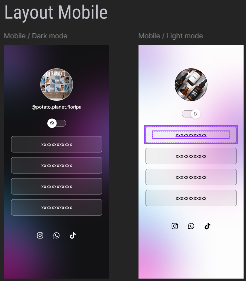

<h1 align="center"> Simple Organic</h1>

Desenvolvido por Gilnei Morro.

  <a href="#-tecnologias">Simple Organic</a>&nbsp;&nbsp;&nbsp;|&nbsp;&nbsp;&nbsp;
  <a href="#-projeto">Projeto</a>&nbsp;&nbsp;&nbsp;|&nbsp;&nbsp;&nbsp;
  <a href="#-layout">Layout</a>&nbsp;&nbsp;&nbsp;

  

 

## 🚀 Tecnologia

Esse projeto foi desenvolvido com as seguintes tecnologias:

- HTML e CSS
- JavaScript
- Git e Github
- Figma

## 💻 Projeto

Criado para fins de estudo.

## 🔖 Layout

Projeto não compartilhado.